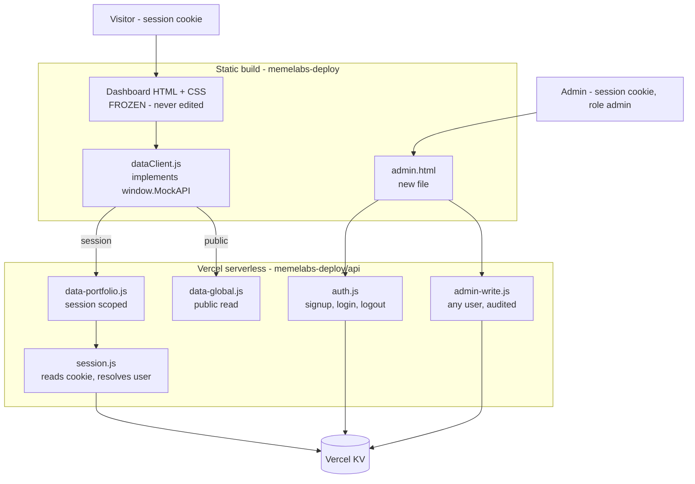

# Static Site — Per-User Data Layer + Admin Panel

## Context

The React rewrite in `MemeDEXofficial/` was abandoned. It re-authored the markup and class
structure instead of preserving the original DOM/CSS, so it cannot achieve the verbatim
visual parity you need. We are back to the static build.

**Decision:** `memelabs-deploy/` is the production site. Its HTML and CSS are frozen. The
data and auth layers are added around it without touching a single tag of markup.

**Goal:** each signed-in account sees its own balances, and you can edit any account's
balances from an admin page while the site is live.

---

## What changed from the global-data revision

Choosing **per-user** alters three things materially:

1. **The read endpoint is no longer public.** It must require a session and must derive the
   user from the cookie — never from a query parameter or request body. A public
   `/api/data` would hand every visitor a full ledger of every account.
2. **There is now a real authentication system** to build. [`auth.js`](memelabs-deploy/auth.js)
   is localStorage-based; it gates navigation but cannot establish identity, so the existing
   login and signup flow has to be replaced with server-side sessions.
3. **The store needs user and session records**, not one document. Vercel KV still fits —
   this is structured key/value data with no relational querying — and it keeps everything
   inside the Vercel account the site already deploys to. Supabase remains the alternative
   if managed auth and row-level security are preferred over owning the session code.

---

## Findings that shape this plan

### 1. The data seam is already correct

Every dashboard balance flows through one object in
[`mockData.js`](memelabs-deploy/dashboard/api/mockData.js:119). No HTML page touches the
`MOCK_*` constants directly. We replace the *implementation* behind `window.MockAPI` and
keep the *interface*, so the HTML never changes — parity is guaranteed by construction
rather than by inspection.

### 2. `getSolPrice()` is synchronous — this constrains the design

[`mockData.js:178`](memelabs-deploy/dashboard/api/mockData.js:178) returns a plain number
immediately, unlike every other method. It cannot become `async` without breaking callers.

Keep it synchronous: fetch once at load, cache in a module variable, refresh on a timer.

```js
let solPriceCache = 158.42;

async function refreshSolPrice() {
  const res = await fetch('/api/global');
  const doc = await res.json();
  solPriceCache = doc.solPriceUsd;
}

refreshSolPrice();
setInterval(refreshSolPrice, 30000);
```

### 3. The mock numbers do not reconcile — do not auto-derive totals

For TAKEOVER, `tokens * priceUsd` gives `3.82` but `balance` holds `3820` — off by 1000x.
Summing holdings will not produce `total_value_usd: 29360`.

Keep `total_value_usd` and `total_value_sol` as independently editable per-user fields.
Auto-derivation is deferred until real DexScreener prices replace the fixtures, at which
point the arithmetic becomes meaningful. Deriving now would ship wrong numbers.

### 4. New accounts need a template

A fresh signup must land on a dashboard that looks like the one shipping today, so account
creation seeds the per-user portfolio from the current mock constants.

---

## Architecture

Three tiers of data with different audiences:



---

## Auth model

- **Passwords** hashed with `scrypt` from `node:crypto`, per-user salt. Never stored or
  logged in plaintext.
- **Sessions** are opaque random tokens stored in KV, delivered as `httpOnly`, `secure`,
  `sameSite: strict` cookies. Opaque rather than signed so a session can be revoked
  server-side — a signed token cannot be.
- **Logout** deletes the KV record, so the cookie stops working immediately.
- **CSRF** — `sameSite: strict` blocks cross-site cookie sending, plus writes require a
  matching `x-requested-with` header as a second check.
- **Admin role** is a field on the user record. Every admin write re-checks it server-side.

The existing [`auth.js`](memelabs-deploy/auth.js) is left in place for navigation gating
only. It is not trusted for identity.

---

## Data model

Three KV namespaces, split by audience:

```
user:{userId}          -> { id, email, username, passwordHash, salt, role, createdAt }
session:{token}        -> { userId, expiresAt }
portfolio:{userId}     -> { holdings[], total_trades, lb_rank, total_value_usd, total_value_sol }
global                 -> { solPriceUsd, customTokens[], leaderboardWhales[] }
```

The **global** tier holds data identical for every visitor — SOL price, custom tokens, and
the synthetic leaderboard filler. The **portfolio** tier is per-user and only ever read
through a session.

Field names are copied verbatim from [`mockData.js:7`](memelabs-deploy/dashboard/api/mockData.js:7),
[`mockData.js:66`](memelabs-deploy/dashboard/api/mockData.js:66), and
[`mockData.js:79`](memelabs-deploy/dashboard/api/mockData.js:79) so no consumer changes.

```json
{
  "holdings": [
    {
      "token_name": "ODAI",
      "sub": "ODEI AI",
      "img": "../assets/images/odai.webp",
      "tokens": "47000",
      "balance": "14230",
      "chainID": "solana",
      "pairAddress": "odai_pair_address",
      "priceUsd": 0.000302,
      "mcap": 14230000
    }
  ],
  "total_trades": 142,
  "lb_rank": 247,
  "total_value_usd": 29360,
  "total_value_sol": 185.42
}
```

Two deliberate departures from current behaviour:

- The random ±2% balance jitter and random trade-count drift are removed. Real balances
  that drift on their own would make it impossible to tell whether the wiring works.
- `solPriceUsd` becomes admin-editable rather than fluctuating every 30 seconds.

---

## Accessing the admin panel

The admin panel is a standalone page at the deployment root. There is no link to it from
the site nav, footer, or dashboard — you reach it by typing the URL directly.

```text
https://your-domain.com/admin.html
```

Locally, while developing against `vercel dev` or a static server serving
[`memelabs-deploy/`](memelabs-deploy/):

```text
http://localhost:3000/admin.html
```

On first visit it asks for the admin password. That password is stored hashed in the
deployment environment, never in the repo, so it is set in Vercel project settings rather
than in a committed file. A successful login sets an `httpOnly` session cookie, and only
accounts with the `admin` role are let past the login screen.

Because the page is unlisted rather than hidden, obscurity is not the protection — the
server-side role check on every admin route is. Even if someone finds the URL, they reach a
login form and nothing else.

### Daily workflow

1. Open `/admin.html` and log in.
2. Pick an account from the user list.
3. Edit balances, trade count, rank, and holdings. Values validate as you type and clamp
   to sane ranges.
4. Save. The write is recorded with a timestamp and your username in the audit trail.
5. Refresh the dashboard as that user to confirm the new figures.

---

## API surface

| Route | Auth | Purpose |
| --- | --- | --- |
| `POST /api/auth` | none | signup, login, logout |
| `GET /api/global` | none | SOL price, custom tokens, leaderboard filler |
| `GET /api/portfolio` | session | current user's holdings and summary |
| `PUT /api/portfolio` | session | user edits own profile fields |
| `GET /api/admin/users` | admin | list accounts |
| `PUT /api/admin/users/:id/portfolio` | admin | edit any user's balances |

Every session-scoped route resolves the user from the cookie alone. No route accepts a
user id from client input for read access — that is the difference between per-user data
and a public ledger.

---

## Phases

**Phase 0 — Freeze the canonical source.** Complete. What was actually found:

- **The canonical site is `memelabs-deploy/`.** The uncommitted static edits were routing
  and auth changes. They were held back with `git stash push -- memelabs-deploy` and then
  re-applied with `git stash apply`, so the 13 route fixes they contain are live again and
  the stash entry is retained as a backup.
- **The verbatim reference is `_archive/MEMDEX 11/`** — 104 files, including the `meme1st`,
  `meme2nd` and `meme3rd` design captures (45 files). It is gitignored, so it is absent
  from `git status` and from editor file trees, which makes it easy to mistake for deleted.
  It is not deleted. All 59 git-tracked files inside it match `HEAD` byte for byte.
- **CSS has not drifted.** `style.css`, `dashboard.css`, `trade.css` and `profile.css` are
  byte-identical between the reference and `memelabs-deploy/`.
- **HTML has drifted, but mostly only in routing.** Ten of the eleven shared files differ
  by 1–4 lines. The exception is `index.html`, which was rewritten (+305/−393 lines) and
  dropped the `<section class="hero">` wrapper the reference has.
- **`app.html` does not exist in `memelabs-deploy/`**, so the reference's hash routes
  (`app.html#/login`) had to become plain file paths.

The freeze is now enforced rather than merely intended: `memelabs-deploy/FROZEN.sha256`
records the 17 `.html`/`.css` hashes, and `memelabs-deploy/scripts/check-freeze.mjs`
exits non-zero on any change, deletion, or unrecorded addition.

**Phase 1 — Provision storage.** Create the Vercel KV store, set environment variables,
seed `global` with today's constants and a template portfolio for account creation.

**Phase 2 — Auth.** Signup, login, logout, session resolution. Password hashing, cookie
attributes, and revocation.

**Phase 3 — Read endpoints.** `data-global.js` public; `data-portfolio.js` session-scoped
with an `ETag` and `no-store` so admin edits appear on next refresh.

**Phase 4 — Client adapter.** Rewrite the implementation behind `window.MockAPI` to call
the new endpoints, keeping method names, argument order, and return shapes identical.
Preserve the synchronous `getSolPrice()` via the cached-poll pattern. Fall back to the
embedded constants if the API is unreachable so the site still renders during an outage.

**Phase 5 — Admin.** `admin.html` plus its script, styled from
[`style.css`](memelabs-deploy/style.css) so it looks native. Account list, per-user balance
editing, audit trail. No route in the site links to it.

**Phase 6 — Verify.** Side-by-side screenshots at desktop, tablet, and mobile against the
frozen source. Confirm markup is byte-identical via `git diff` on the HTML files. Confirm
two accounts see different balances and that account A cannot read account B.

---

## Files touched

**New**

- `memelabs-deploy/api/auth.js`
- `memelabs-deploy/api/data-global.js`
- `memelabs-deploy/api/data-portfolio.js`
- `memelabs-deploy/api/admin-users.js`
- `memelabs-deploy/api/admin-portfolio.js`
- `memelabs-deploy/admin.html`
- `memelabs-deploy/admin.js`

**Modified (implementation only, same public interface)**

- `memelabs-deploy/dashboard/api/mockData.js`

**Not modified**

- Every `.html` file in `memelabs-deploy/`
- Every `.css` file in `memelabs-deploy/`

---

## Risks and open questions

1. **Canonical source — resolved.** `memelabs-deploy/` is the site and `_archive/MEMDEX 11/`
   is the reference, confirmed by hash comparison rather than by inspection. See Phase 0.
2. **How `lb_rank` should work.** The current data implies 247 users, but only real users
   will exist. Either the rank is admin-set per user, or it is computed by placing the user
   into the synthetic whale list ordered by earnings. The second is self-consistent and
   updates itself; the first is simpler but can drift out of order.
3. **Real balances versus demo balances.** If these numbers represent actual user funds,
   withdrawals and trades need to move them, and the admin panel becomes a financial
   surface requiring far stronger controls. If they are demo data, this plan is sufficient
   as written.
4. **`cleanUrls: true`** in [`vercel.json`](memelabs-deploy/vercel.json:3) — confirm
   function routes resolve without extension changes once they exist.
5. **The existing login and signup pages** will post to a real endpoint instead of
   localStorage. Their markup stays frozen; only the script they call changes.
6. **The post-login redirect is broken, and fixing it collides with the freeze.**
   [`login.html`](../memelabs-deploy/login.html) and [`signup.html`](../memelabs-deploy/signup.html)
   still route to `'##/dashboard'`, which resolves to a non-existent `##/dashboard` path
   instead of `dashboard/index.html`. Those lines sit inside frozen files, so the fix
   requires deliberately re-baselining `FROZEN.sha256`. It is the first real test of the
   freeze rule, so re-baseline it as a reviewed decision rather than as a reflex.
7. **`compare-classes.mjs` overstates drift.** It diffs only against `globals.css`, ignoring
   the six stylesheets in `src/styles/`, and counts Tailwind utilities such as `absolute`
   and `border-b` as parity failures. Its current output — 145 matched, 347 unmatched — is
   a rough signal, not a verdict.
